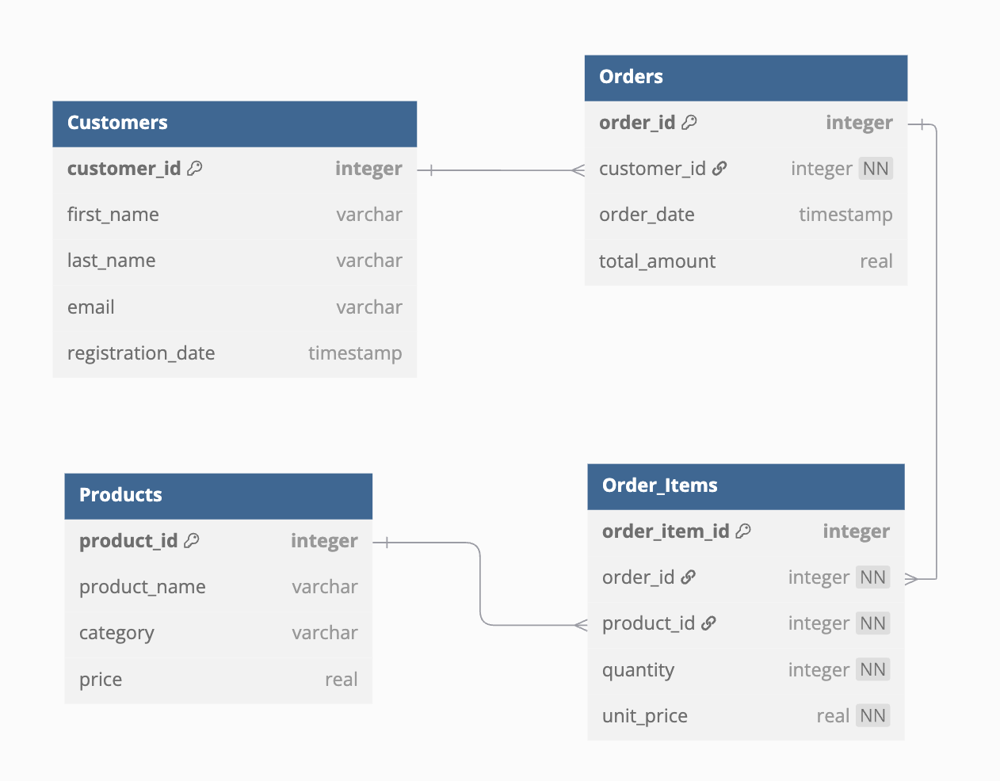

# Legal Desk Student Data-Scientist
This is a small task applicants will be asked to perform as part of the screening process. 

This is a task that simulates what a clasical task could be for a student data-scientist/analyst when working at Legal Desk. We have created some synthetic sample data which could mimic how our interal data-structures look. This will also lay the basis for some talking points at the interview. 

Please make a github repository where you upload either code for streamlit dashboard (remember to include requirements.txt), or if you prefer a jupyter notebook. The code should query the Sqlite DB, and create plots that visualize the data with respect to some business intelligence objective. Please write a few sentences to the visualization(s) about what value and insights they create (does not have to be a lot). 

## Inspiration for BI objectives
Note that these are not mandatory but just for inspiration: 
- Understand which customers are most valuable
- Understand which products are most valueable
- Orders over time

## What we would like to see
Please try to display the following as best you can: 
- Abillity to work with multiple tables and some basic sql skills
- Your ability to work with data in python, and wrangle some data with pandas
- Abillity to select proper visualizations for for the objective 
- And at last creativity is alsways valued :)

### Image of ER-Diagram

